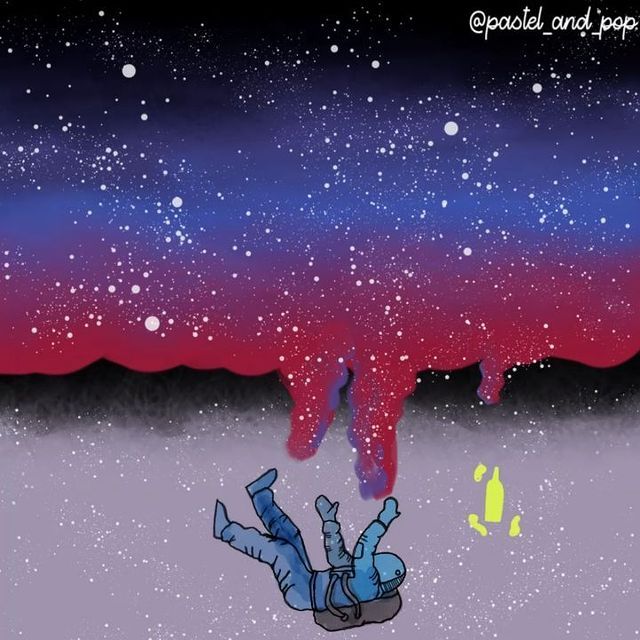

```{r setup, include=FALSE}
knitr::opts_chunk$set(echo = TRUE)

```

# **My Illustrations**

[{style="padding:5px;" width="200"}](https://www.instagram.com/p/CMJQCAggtul/) {style="padding:5px;" width="200"} [{style="padding:5px;" width="200"}](https://www.instagram.com/p/CCREdJ7pAVk/) [{style="padding:5px;" width="200"}](https://www.instagram.com/p/CCJJI2AJT0y/) [{style="padding:5px;" width="200"}](https://www.instagram.com/p/CClqWEDpa6v/) [{style="padding:5px;" width="200"}](https://www.instagram.com/p/CCyj0ZeJw2u/) [{style="padding:5px;" width="200"}](https://www.instagram.com/p/CCv6oS-ph1-/) [{style="padding:5px;" width="200"}](https://www.instagram.com/p/CC3oDvdJwsX/) [{style="padding:5px;" width="200"}](https://www.instagram.com/p/CC_ciAeJ_UE/) [{style="padding:5px;" width="200"}](https://www.instagram.com/p/CDB7wpeJeVu/) [{style="padding:5px;" width="200"}](https://www.instagram.com/p/CC1Eh2lpaMV/) [{style="padding:5px;" width="200"}](https://www.instagram.com/p/CDHFWMJpVE-/) [{style="padding:5px;" width="200"}](https://www.instagram.com/p/CDO0ggbpGxP/) [{style="padding:5px;" width="200"}](https://www.instagram.com/p/CDoipB2JUO_/) [{style="padding:5px;" width="200"}](https://www.instagram.com/p/CD3_YdjpIT1/)
